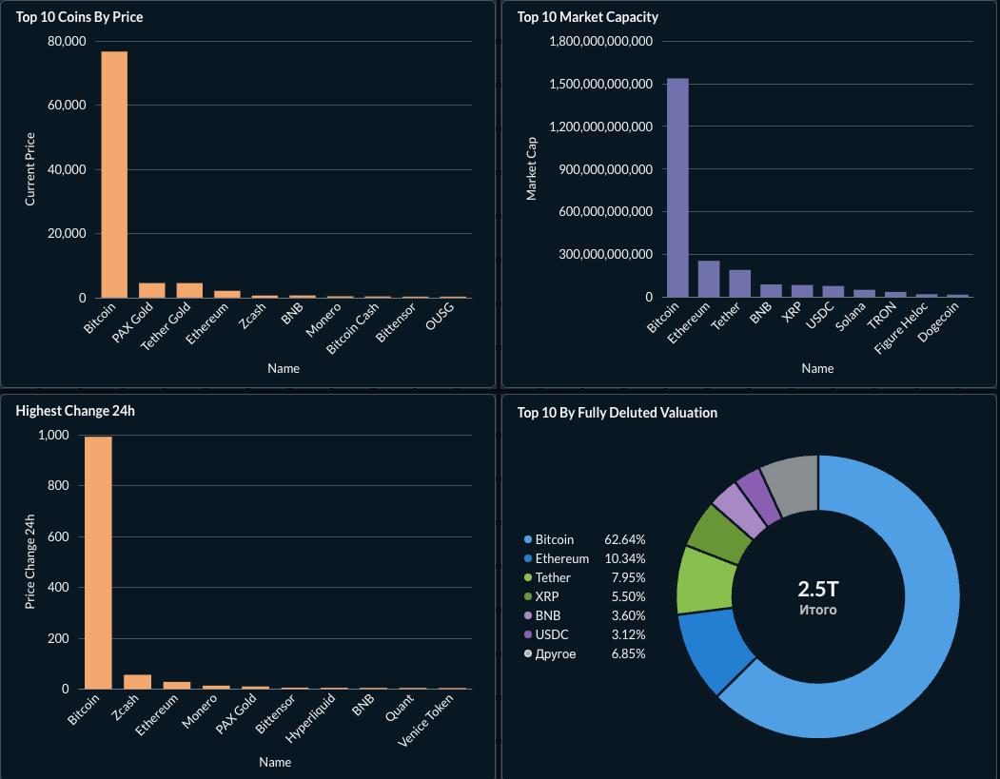

# CoinGecko ETL Pipeline
Автоматизированный data pipeline для сбора, хранения и визуализации данных криптовалютного рынка с CoinGecko API.

## Дашборд 




## Архитектура
``` 
CoinGecko API
      │
      ▼
   Airflow DAG (gecko_coins_dag.py)
      │
      ├──► Яндекс S3 (JSON снапшоты, партиционированные по дате)
      │
      └──► PostgreSQL / Neon (таблица gecko_coins)
                │
                ▼
             dbt (аналитические модели)
                │
                ▼
            Metabase (дашборд)

``` 

## Стек

| Слой | Инструмент |
|---|---|
| Оркестрация | Apache Airflow |
| Источник данных | CoinGecko API |
| Хранилище | Яндекс Object Storage (S3) |
| База данных | PostgreSQL (Neon) |
| Трансформации | dbt |
| Визуализация | Metabase |

## Структура проекта

``` 
CoinGecko_ETL_Airflow/
├── dags/
│   └── gecko_coins_dag.py        # Airflow DAG — сбор и загрузка данных
├── crypto_analytics/             # dbt проект
│   ├── models/
│   │   └── marts/
│   │       ├── top_10_coins_by_price.sql
│   │       ├── top_10_by_fully_deluted_valuation.sql
│   │       ├── top_10_market_capacity.sql
│   │       └── highest_change_24h.sql
│   ├── dbt_project.yml
│   └── ...
├── docker-compose.yaml           # Запуск Airflow локально
├── .env                          # Переменные окружения (не в git)
└── Dashboard.jpeg                # Скриншот дашборда

``` 

## Что делает pipeline

1. Airflow DAG запускается по расписанию и вызывает CoinGecko API
2. Данные сохраняются в Яндекс S3 как JSON снапшоты, партиционированные по дате (date=YYYY-MM-DD/markets_HH-MM-SS.json)
3. Параллельно те же данные записываются в PostgreSQL на Neon
4. dbt строит аналитические витрины поверх таблицы
5. Metabase визуализирует витрины в виде дашборда

## Как запустить
1. Клонировать репозиторий
```
git clone https://github.com/murasakir1n/CoinGecko_ETL_Airflow.git
```
```
cd CoinGecko_ETL_Airflow
```
2. Заполнить .env
```
DATABASE_URL=postgresql://...
AWS_ACCESS_KEY_ID=...
AWS_SECRET_ACCESS_KEY=...
```
3. Запустить Airflow
```
docker-compose up -d
```
4. Запустить dbt модели
```
cd crypto_analytics
```
```
dbt run
```
## dbt модели

| Модель      | Описание |
|-------------|-----|
| top_10_coins_by_price | Топ-10 монет по текущей цене    |
| top_10_by_fully_deluted_valuation | Топ-10 по fully diluted valuation |
| top_10_market_capacity | Топ-10 по рыночной капитализации |
| highest_change_24h |Монеты с наибольшим изменением цены за 24ч|
